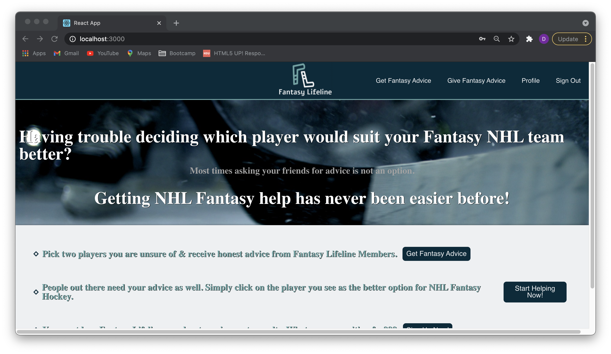
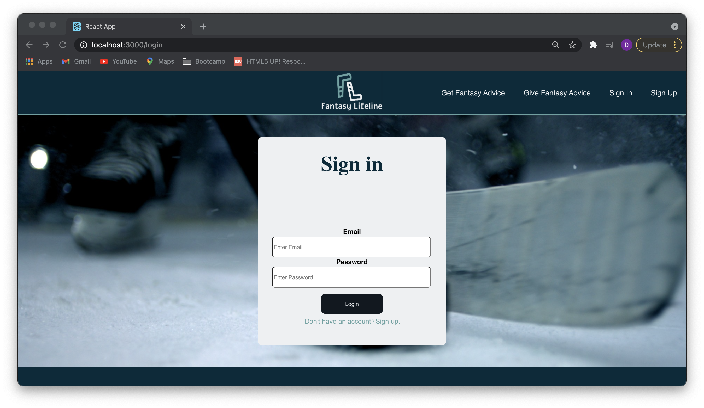
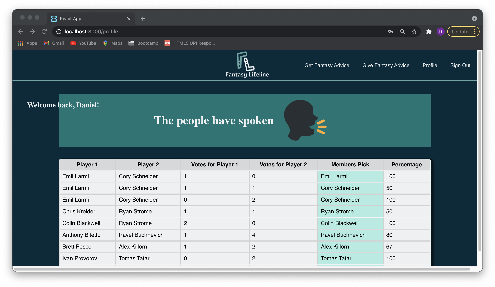

<h1>Welcome to Fantasy Lifeline</h1>

I'm excited to present to you my final project for Concordia's web development bootcamp!

Do you participate in a NHL fantasy hockey pool? Have you ever been unsure of which player you should add/drop? If so, you came to the right place!

Most times Fantasy Hockey pools are created among friends. Finding honest help isn't always easy & that's why i created Fantasy Lifeline.

Simply,

1. Create an account.
2. Select the two players you are undecided about. Post it.
3. Give some time to fellow FantasyLifeLine members to give their advice.
4. Return to profile page to see the results.
5. Don't forget to return the favour! Head over to "Give Fantasy Help" and simply click on the player you think is the better option.
<h2>Youtube Demo:</h2>
<a href="https://www.youtube.com/watch?v=RULiBI3lWzI">Fantasy Lifeline demo</a>

<h2> Homepage </h2>
</img>

<h2> Sign Up </h2>
Members must sign up in order to get access to a profile page which displays vote results. 
</img>
<h2> Sign In </h2>
Members must sign in using their email & password to see results of previously submited questions.
</img>
<h2> Create new Request </h2>

Are you in need of Fantasy help? Simply click on "Get Fantasy Help" and select your two players using the drop down menu. Once the two players in question are selected. Press Submit. Now just sit back and wait for other members to give their advice.

<h2> Give your advice </h2>

Let's not be selfish now. While waiting for your advice why not share some of your knowledge. Click on "Give Fantasy Advice" and simply click on the player you think is the better option. Not sure who to pick? Simply click the "skip" button to load the next question.

<h2> Profile </h2>
The profile page is where you will find all the results to the questions you have asked. Must be logged in to access this page.

